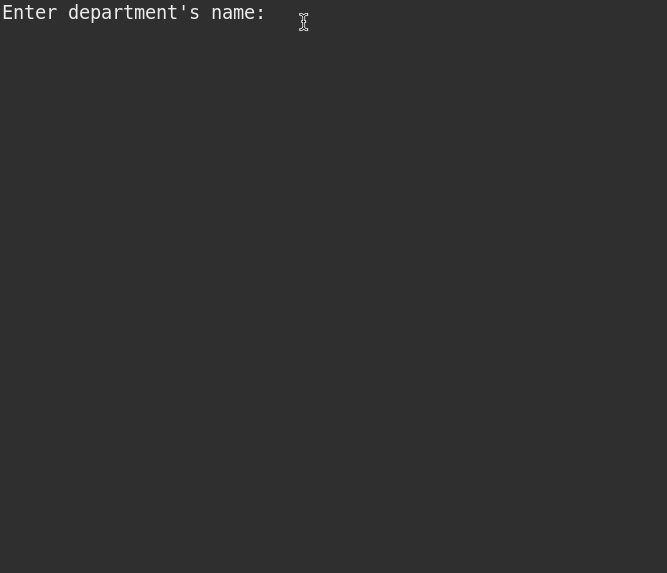

 # Worker Algorithm

***

Algorithm made in Java with Eclipse IDE. 
* This project was made in Eclipse IDE 
* This project relies on internal components to function.

### **Intention**
***
The purpose of this project was to practice O.O.P (object-oriented programming) in Java.
___
___
### Explanation of the Algorithm
The algorithm is intended to read the data of a worker with N contracts (provide by the user).
Then ask the user month and year to calculate the employee's salary in the month.
Finally show a summary with name, department and salary of the month provide by the user.

---
### Summary of the Code
This algorithm was made with 4 <b>Classes</b>, being one of them the main class and 1 <b>Enum</b>.

* **Class Department**
Variables:
    - String name = a String that takes the department name of the employee.
* **Class HourContract**
Variables:
    - Date date = a date for the contract
    - double valuePerHour = for the value earned per hour of the worker.
    - Integer hours = for the amount of hours worked by the employee.
* **Class Worker**
    Variables:
    - String name = a String for the employee's name.
    - WorkerLevel level = an enumerator for the employee's level.
    - double baseSalary = for the base salary of the employee.
    - Department department = a Department variable named department.
    - List< HourContract > contracts =  a list type HourContract named contracts.
* **Enum WorkerLevel**
    - JUNIOR, PLENO, SENIOR = the level of the employee.

#### Imports
    - import java.text.ParseException;
    - import java.text.SimpleDateFormat;
    - import java.util.Date;
    - import java.util.Scanner;

### Method's

Explanation of the methods used in the algorithm.

##### Class HourContract
~~~java
public double totalValue() {
		return valuePerHour * hours;
	}
~~~
> This method was made to calculate the total value of the contract, using 2 variables (valuePerHour * hours).

##### Class Worker

~~~java
public void addContract(HourContract contract) {
		contracts.add(contract);
	}
~~~

> This method add a contract in a list (contracts)

~~~java
public void removeContract(HourContract contract) {
		contracts.remove(contract);
	}
~~~

> This method remove a contract in a list (contracts)

~~~java
public double income(Integer year, Integer month) {
        double sum = baseSalary;
        Calendar cal = Calendar.getInstance();
        for (HourContract c : contracts) {
            cal.setTime(c.getDate());	
            int c_month = 1 + cal.get(Calendar.MONTH);
            int c_year = cal.get(Calendar.YEAR);
            if(month == c_month && year == c_year) {
                sum += c.totalValue();
            }
        }
        return sum;
	}
~~~

> A method to calculate the sum of all contracts + thge basic salary of the employee, given a month and year informed by the user.

# Image of Application

# Instalation

Clone this repository in your local machine with the command:

- git clone https://github.com/bywilliams/worker_program.git

## Author
***
> William Silva -> [site e portfolio pessoal](https://bywilliams.github.io/site/)

**Thank you for following the documentation and explanation of this little algorithm.**